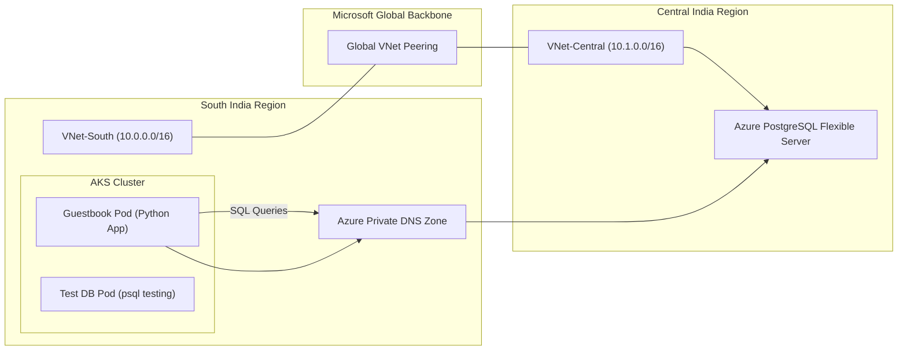

# AKS to PostgreSQL Cross-Region Architecture (Azure)


---

# Project Overview

This project demonstrates a **secure cross-region architecture on Azure** where an application running in **Azure Kubernetes Service (AKS)** communicates with a **PostgreSQL Flexible Server** in another region using **private networking**.

The design ensures:

* No public database exposure
* Cross-region private connectivity
* Secure encrypted traffic
* Separation of compute and data layers

---

# Architecture Diagram



---

# Infrastructure Components

## Region A – South India (Application Layer)

### Azure Kubernetes Service (AKS)

Managed Kubernetes cluster hosting application workloads.

Deployed pods:

**Guestbook Pod**

* Python microservice
* Executes SQL queries against PostgreSQL

**Test-DB Pod**

* Utility container
* Used to verify database connectivity using `psql`

---

### Virtual Network – VNet South

Example address space:

```
10.0.0.0/16
```

Hosts AKS nodes and networking resources.

---

## Region B – Central India (Data Layer)

### Azure Database for PostgreSQL – Flexible Server

Managed PostgreSQL service providing:

* automatic backups
* patch management
* scaling and maintenance
* high availability support

---

### Virtual Network – VNet Central

Example address space:

```
10.1.0.0/16
```

Contains a **delegated subnet** used by the PostgreSQL Flexible Server.

---

# Connectivity and Security

## Global VNet Peering

Connects the two VNets privately across regions.

```
VNet-South  <------->  VNet-Central
```

Benefits:

* private IP connectivity
* low latency
* Azure backbone routing

---

## Azure Private DNS Zone

Used to resolve the PostgreSQL hostname to its **private IP**.

Example endpoint:

```
first-server2873.postgres.database.azure.com
```

The DNS zone is linked to both VNets so pods can resolve the database internally.

---

## TLS / SSL Encryption

All database communication is encrypted using:

```
sslmode=require
```

Ensures encrypted data transfer between application and database.

---

# Traffic Flow

### 1. Application Request

A pod inside the AKS cluster initiates a database connection.

### 2. DNS Resolution

The request resolves using **Azure Private DNS Zone**, returning the database private IP.

### 3. Routing

Azure networking routes the traffic through **Global VNet Peering**.

### 4. Backbone Transit

Traffic travels through the **Microsoft Global Backbone Network**, bypassing the public internet.

### 5. Database Access

The PostgreSQL server receives the request on port:

```
5432
```

The server authenticates the user and executes the SQL query.

---

# Security Design

Security measures implemented:

* No public endpoints exposed
* Private VNet connectivity
* TLS encrypted database connections
* Regional network isolation

---

# Performance Benefits

Using **Global VNet Peering** provides:

* low latency connectivity
* high bandwidth networking
* traffic routed via Azure backbone

Compared to:

* VPN tunnels
* public internet routing

---

# Operational Benefits

Using **PostgreSQL Flexible Server** offloads operational overhead:

* automated backups
* patching
* infrastructure management
* high availability

Teams can focus on **application development instead of database maintenance**.

---

# Disaster Recovery Considerations

The architecture distributes workloads across two regions:

| Region        | Component         |
| ------------- | ----------------- |
| South India   | Application Layer |
| Central India | Database Layer    |

This separation improves resilience against **regional outages**.

---

# Technologies Used

* Azure Kubernetes Service (AKS)
* Azure Database for PostgreSQL Flexible Server
* Azure Virtual Network
* Global VNet Peering
* Azure Private DNS Zone
* Kubernetes
* Python Microservice
* PostgreSQL

